# jQuery-Vuejs
Proyecto que pretende ayudar a los programadores de jQuery a entender y aplicar Vuejs.

Se presentan diferentes soluciones de complejidad ascendente y a medida que se avanza se muestra como realizarlo en jQuery y en Vuejs. Hay articulo por cada proyecto.

## Indice

### Inicio.  Input Simple.
  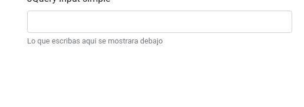
  Tema: Reactividad de la forma mas sencilla. 

  Vuejs: 
  * Uso de {{}}  
  * v-model.   
  * Instancia vue.  
  * Significado de "el".  
  *  ¿Por qué  id="app"?.  
  * Los datos en la instancia de Vuejs (data).  
  JS:  
  * Evento input.  

  [Codigo jQuery](Input/simple/jQueryInputSimple.html)  
  [Codigo Vuejs](Input/simple/VuejsInputSimple.html)  
  [Articulo](https://comunidad.programaresunamierda.com/2020/06/vuejs-para-programadores-jquery-form.html)  

### Control de errores.
  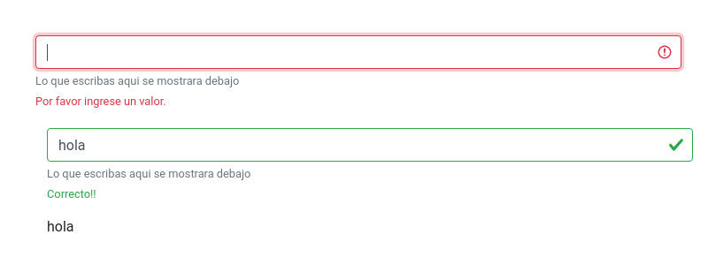

  Tema: Gestión de errores en un input simple

  JS:  
  * if ternario  
  Vuejs:  
  * :class  
  * @ para los eventos en vuejs. 

  [Codigo jQuery](Input/Errores/jQueryInputErrors.html)  
  [Codigo Vuejs](Input/Errores/VuejsInputErrors.html)  
  [Articulo](https://comunidad.programaresunamierda.com/2020/06/vuejs-para-programadores-jquery-form_9.html)  

### Filtro de contenido
  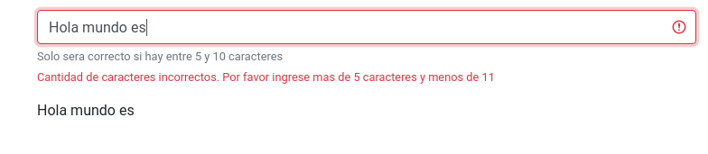

  Tema: Gestión sencilla de filtro de contenido en un input.

  Vuejs:  
  * THIS  

  [Codigo jQuery](Input/filtros/jQueryInputFilter.html)  
  [Codigo Vuejs](Input/filtros/VuejsInputFilter.html)  
  [Articulo](https://comunidad.programaresunamierda.com/2020/06/vuejs-para-programadores-jquery-form_11.html)  

### RadioButton y CheckBox
    

  Tema: Control de check box y Radio button.

  Vuejs:
  * v-model con arrays y booleans  

  [Codigo jQuery Radio Button](ControlSimple/radiobutton/jQueryRadioButton.html)  
  [Codigo Vuejs Radio Button](ControlSimple/radiobutton/VuejsRadioButton.html)  
  [Codigo jQuery CheckBox](ControlSimple/checkbox/jQueryCheckBox.html)  
  [Codigo Vuejs CheckBox](ControlSimple/checkbox/VuejsCheckBox.html)  
  [Articulo](https://comunidad.programaresunamierda.com/2020/06/vuejs-para-programadores-jquery_12.html)  

### Estilos Inline y Clases CSS
  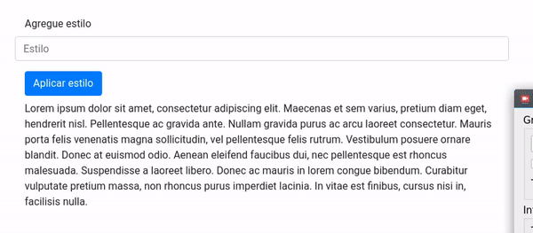  
  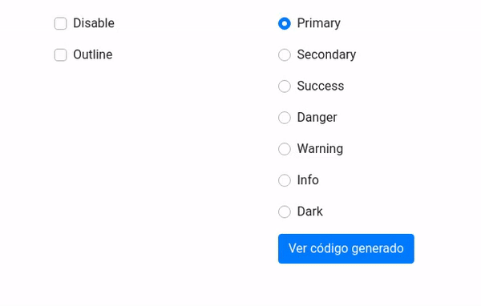  

  Tema: Style Inlne y clases Css

  Vuejs: 
  * @click
  * :style
  * v-if
  * v-else
  * Virtual DOM
  * Computadas  

  [Codigo jQuery Estilos inline](Button/Estilos/jQueryButtonStyle.html)  
  [Codigo Vuejs Estilos inline](Button/Estilos/VuejsButtonStyle.html)  
  [Codigo jQuery Clases CSS](Button/Clases/jQueryButtonClass.html)  
  [Codigo Vuejs Class CSS](Button/Clases/VuejsButtonClass.html)  
  [Articulo](https://comunidad.programaresunamierda.com/2020/06/vuejs-para-programadores-jquery-clases.html)  

### Tabuladores
  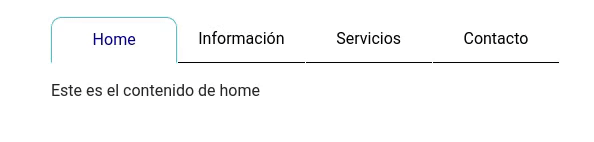

  Tema: Un sistema simple de tabs para diferente contenido

  Vuejs:
  * v-show
  * v-for

  jQuery:
  * Eventos (evt)

  [Codigo jQuery](Navs/tabulacion/jQueryTabulacion.html)  
  [Codigo Vuejs](Navs/tabulacion/VuejsTabulacion.html)  
  [Articulo](https://comunidad.programaresunamierda.com/2020/06/vuejs-para-programadores-jquery_16.html)  

### Select Simple
  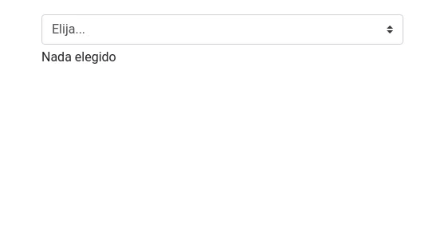  
  Tema: Sistema simple de Select.

  Vuejs: 
  * v-model en select.

  [Codigo jQuery](Select/Simple/jQuerySelectSimple.html)  
  [Codigo Vuejs](Select/Simple/VuejsSelectSimple.html)  
  [Articulo](https://comunidad.programaresunamierda.com/2020/06/vuejs-para-programadores-jquery-select.html)  

### Select relacionados
  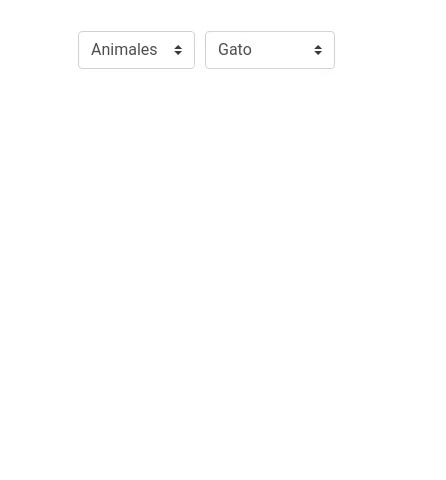

  Tema: control de contenido son selects relacionados entre si.

  Vuejs:
  * watch
  JS:
  * Importacion de constante externa
  * Funcionamiento de < script >
  * every()
  * Notacion Arrow
  * Join()
  * find()
  * if y else innecesarios

  jQuery:
  * Funciones templates

  [Codigo jQuery](Select/Relacionados/jQuerySelectRelacionados.html)  
  [Codigo Vuejs](Select/Relacionados/VuejsSelectRelacionados.html)  
  [Articulos](https://comunidad.programaresunamierda.com/2020/06/vuejs-para-programadores-jquery-selects.html)  

### Filtros en Selects
  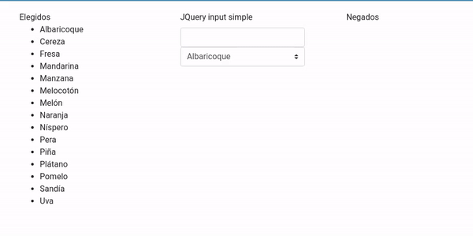  
  Temas: Filtrar el contenido de un Select  
  
  JS: 
  * Desestructuracion
  * Plantillas de cadenas de texto ${}
  * filter()
  * includes()

  [Codigo jQuery](Select/Filtro/jQuerySelectFiltro.html)  
  [Codigo Vuejs](Select/Filtro/VuejsSelectFiltro.html)  
  [Articulo](https://comunidad.programaresunamierda.com/2020/06/vuejs-para-programadores-jquery-selects_19.html)  

### Select dinamicos y componentes
  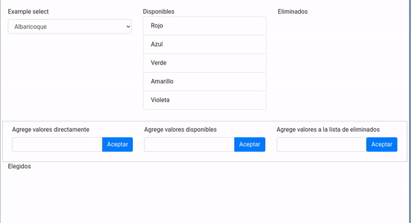  
  Tema: Select con contenidos dinamicos y creacion del primer componente.
  JS:
  * Copias por referencias (arrays, objectos)
  * findIndex()
  * splice()
  * incremento (++pre y post++)  

  Vuejs:
  * Componentes (expicacion, concepto, creacion)
  * $emit
  * Eventos propios

  [Codigo jQuery](Select/Dinamico/jQuerySelectDinamico.html)  
  [Codigo Vuejs](Select/Dinamico/VuejsSelectDinamico.html)  
  [Articulo](https://comunidad.programaresunamierda.com/2020/06/vuejs-para-programadores-jquery-selects_22.html)  

### Sencilla hoja de calculo
  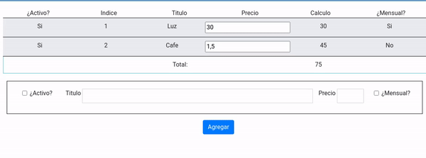  
  Temas: Sencilla logica del funcionamiento de una hoja de calculo.

  [Codigo jQuery](Select/Spread%20Sheet/jQuerySpreadSheet.html)  
  [Codigo Vuejs](Select/Spread%20Sheet/VuejsSpreadSheet.html)  
  [Articulo](https://comunidad.programaresunamierda.com/2020/06/vuejs-para-programadores-jquery-una.html)  

### Galería de imágenes
  

  Temas: Una galeria de imagenes sencilla.
  CSS:
  * @keyframe 

  JS:
  * setTimeout() 
  
  VueJS:
  * Ciclo de vida de un componente.

  [Codigo jQuery](Imagenes/Galeria/jQueryGaleriaImagenes.html)  
  [Codigo Vuejs](Imagenes/Galeria/VuejsGaleriaImagenes.html)  
  [Articulo](https://comunidad.programaresunamierda.com/2020/06/vuejs-para-programadores-jquery-galeria.html)  

### Selección múltiple. Menús
  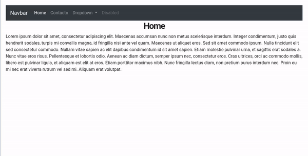  
  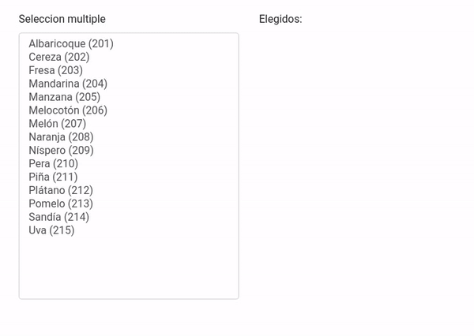  
  Temas: Select con seleccion multiple y menu de opciones.

  Vuejs:
  * Transition

  [Codigo jQuery Seleccion Multiple](Select/Multiple/jQuerySelectMultiple.html)  
  [Codigo Vuejs Seleccion Multiple](Select/Multiple/VuejsSelectMultiple.html)  
  [Codigo jQuery Menus](Navs/Menus/jQueryNavBarMenu.html)  
  [Codigo Vuejs Menus](Navs/Menus/VuejsNavBarMenu.html)  
  [Articulo](https://comunidad.programaresunamierda.com/2020/06/vuejs-para-programadores-jquery-select_25.html)  

### Tabla simple y paginación
  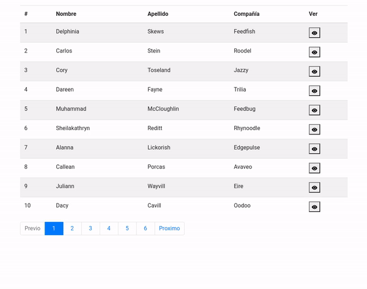

  Tema: Tabla de informacion, modal para expandir datos y paginacion.

  JS: 
  * Array.From  
  
  Vuejs:
  * v-html  

  [Codigo jQuery](Table/Simple/jQueryTableSimple.html)  
  [Codigo Vuejs](Table/Simple/VuejsTableSimple.html)  
  [Articulo](https://comunidad.programaresunamierda.com/2020/06/vuejs-para-programadores-jquery-tablas.html)  