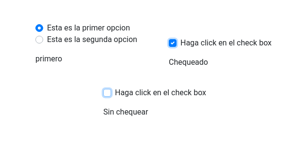

# jQuery-Vuejs
Proyecto que pretende ayudar a los programadores de jQuery a entender y aplicar Vuejs.

Se presentan diferentes soluciones de complejidad ascendente y a medida que se avanza se muestra como realizarlo en jQuery y en Vuejs. Hay articulo por cada proyecto.

## Indice

#### Inicio.  Input Simple.
  

  Tema: Reactividad de la forma mas sencilla. 

  Vuejs: 
  * Uso de {{}}  
  * v-model.   
  * Instancia vue.  
  * Significado de "el".  
  *  ¿Por qué  id="app"?.  
  * Los datos en la instancia de Vuejs (data).  

  JS:  
  * Evento input.  

  [Codigo jQuery](Input/simple/jQueryInputSimple.html)  
  [Codigo Vuejs](Input/simple/VuejsInputSimple.html)  
  [Articulo](https://comunidad.programaresunamierda.com/2020/06/vuejs-para-programadores-jquery-form.html)  

#### Control de errores.
  

  Tema: Gestión de errores en un input simple

  JS:  
  * if ternario  

  Vuejs:  
  * :class  
  
  * @ para los eventos en vuejs. 

  [Codigo jQuery](Input/Errores/jQueryInputErrors.html)  
  [Codigo Vuejs](Input/Errores/VuejsInputErrors.html)  
  [Articulo](https://comunidad.programaresunamierda.com/2020/06/vuejs-para-programadores-jquery-form_9.html)  

#### Filtro de contenido

  Tema: Gestión sencilla de filtro de contenido en un input.

  Vuejs:  
  * THIS  

  [Codigo jQuery](Input/filtros/jQueryInputFilter.html)  
  [Codigo Vuejs](Input/filtros/VuejsInputFilter.html)  
  [Articulo](https://comunidad.programaresunamierda.com/2020/06/vuejs-para-programadores-jquery-form_11.html)  
  
#### RadioButton y CheckBox
  

  Tema: Control de check box y Radio button.

  Vuejs:
  * v-model con arrays y booleans  

  [Codigo jQuery Radio Button](ControlSimple/radiobutton/jQueryRadioButton.html)  
  [Codigo Vuejs Radio Button](ControlSimple/radiobutton/VuejsRadioButton.html)  
  [Codigo jQuery CheckBox](ControlSimple/checkbox/jQueryCheckBox.html)  
  [Codigo Vuejs CheckBox](ControlSimple/checkbox/VuejsCheckBox.html)  
  [Articulo](https://comunidad.programaresunamierda.com/2020/06/vuejs-para-programadores-jquery_12.html)  